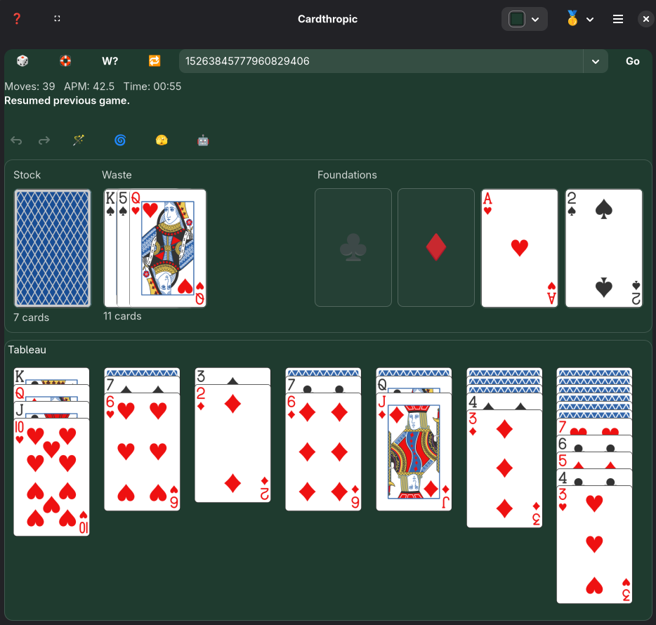

# Cardthropic

Cardthropic is a modern GNOME solitaire app built with Rust, GTK4, and Libadwaita.
It currently ships a full Klondike experience, with architecture already prepared for more variants.


Current version: `0.3.0`
License: `GPL-3.0-or-later`

## Why Cardthropic

Cardthropic is designed to feel native on GNOME while still being playful and experimental:

- Emoji-first controls for fast visual scanning.
- Seed-first gameplay for reproducible runs.
- Strong automation tooling (wand, rapid wand, robot mode).
- Adaptive board layout tuned for small and large viewports.
- Zero network permission at runtime in Flatpak.



## Implemented Features

### Core Klondike

- Full Klondike deal, move, foundation, tableau, draw/recycle flow.
- Draw modes: Deal 1, 2, 3, 4, 5.
- Smart Move modes: Double Click, Single Click, Disabled.
- Undo/redo history.
- Drag-and-drop and click-driven movement.
- Keyboard navigation across stock, waste, foundations, and tableau.

### Automation

- `🪄` Wave Magic Wand: plays the best next move.
- `⚡` Rapid Wand: burst of wand actions over time.
- `🌀` Cyclone Shuffle Tableau: shuffles tableau cards while preserving each column's face-up/face-down geometry.
- `🫣` Peek: temporary reveal mode.
- `🤖` Robot Mode:
  - runs wand actions every 250ms,
  - auto-deals new seeds when stuck/lost,
  - stops when a win is reached,
  - supports precomputed solver-line playback when available.

### Seed and Winnability System

- Seed input and quick actions:
  - `🎲` random deal,
  - `🛟` find/start winnable deal,
  - `W?` test current seed,
  - `🔁` redeal current seed,
  - `Go` launch typed seed.
- Persisted seed history with per-seed stats:
  - Plays,
  - Wins,
  - Recency ordering.
- Seed history capacity controls:
  - stored history cap: `10,000`,
  - dropdown cap: `250` most recent.

### Telemetry and Session Persistence

- Replaces score with APM (actions per minute).
- Time/APM stop on win.
- APM sampled every 5 seconds.
- `APM Graph` dialog for in-session performance visualization.
- Full game session resume on relaunch (seed, mode, board state, timer, moves).

### UI/UX

- Native Libadwaita header + menu model.
- Dedicated in-app Help dialog with live shortcut labels.
- Fullscreen toggle support.
- Board color control with presets/swatches and persistent preferences.
- Custom app icon integrated for desktop/dock/Flatpak metadata.
- Responsive layout with minimum window safeguards.

## Shortcuts

- `F1` Help
- `F11` Toggle Fullscreen
- `Space` Draw
- `Ctrl+Z` Undo
- `Ctrl+Y` Redo
- `Ctrl+Space` Wave Magic Wand
- `Ctrl+Shift+Space` Rapid Wand
- `F3` Peek
- `F5` Cyclone Shuffle Tableau
- `F6` Robot Mode
- `Ctrl+R` Start Random Deal
- `Ctrl+Shift+R` Start Winnable Deal Search
- `Ctrl+Q` Quit

## Game Modes

Cardthropic already includes mode scaffolding for:

- `🥇` Klondike (implemented)
- `🕷️` Spider (UI scaffold ready)
- `🗽` FreeCell (UI scaffold ready)

The engine is being refactored to let additional variants plug in without rewriting the whole window layer.

## Architecture Snapshot

The codebase has been heavily modularized to support long-term maintainability.

### `src/game/`

- `types.rs` shared domain types.
- `setup.rs` game initialization and draw/recycle setup.
- `klondike_moves.rs` move legality and move application.
- `solver.rs` guided/exhaustive winnability and solver-line generation.
- `session_codec.rs` session serialization/deserialization.
- `tests.rs` game logic tests.

### `src/window/`

Window behavior is split into focused modules (`actions_*`, `drag`, `input`, `render`, `seed`, `robot`, `hints`, `menu`, `dialogs`, etc.) instead of a monolithic UI file.

### `src/engine/`

- `moves.rs` hint/solver move mapping.
- `robot.rs` robot playback helpers.
- `seed_history.rs` persistent seed stats store.
- `game_mode.rs` variant runtime seam for future solitaire engines.

## Get Cardthropic (Recommended)

Cardthropic is best installed from the official Flatpak repository so GNOME Software can show full metadata (license, releases, screenshots, updates). Flathub is required.

### Option A: Terminal (Flatpak remote)

```bash
flatpak remote-add --if-not-exists --user --no-gpg-verify cardthropic https://emviolet.codeberg.page/cardthropic-flatpak/
flatpak update --user --appstream cardthropic
flatpak install --user cardthropic io.codeberg.emviolet.cardthropic
flatpak run io.codeberg.emviolet.cardthropic
```

### Fallback: Direct bundle install

If you only have `cardthropic.flatpak`:

```bash
flatpak remote-add --if-not-exists flathub https://flathub.org/repo/flathub.flatpakrepo
flatpak install ./cardthropic.flatpak
flatpak run io.codeberg.emviolet.cardthropic
```

### Ubuntu (GNOME Software + Flatpak)

1. Follow the official Flathub setup guide for Ubuntu:  
   <https://flathub.org/setup/Ubuntu>
2. Ensure GNOME Software Flatpak integration is installed:

```bash
sudo apt install flatpak gnome-software-plugin-flatpak
```

3. Log out/in (or reboot) so GNOME Software loads Flatpak support.
4. Add Flathub and install the GNOME runtime dependency:

```bash
flatpak remote-add --if-not-exists flathub https://flathub.org/repo/flathub.flatpakrepo
flatpak install -y flathub org.gnome.Platform//48
```

5. Add Cardthropic remote and install:

```bash
flatpak remote-add --if-not-exists --user --no-gpg-verify cardthropic https://emviolet.codeberg.page/cardthropic-flatpak/
flatpak update --user --appstream cardthropic
flatpak install --user cardthropic io.codeberg.emviolet.cardthropic
```

Snap package note: Flatpak is the only supported package right now. A Snap package may be added in the future.

## For Developers

### Rust local run

```bash
cargo check
cargo run
```

### Flatpak local developer workflow

```bash
scripts/flatpak/bootstrap.sh
scripts/flatpak/build-install.sh
scripts/flatpak/run.sh
```

### Publish/update Flatpak repo (Codeberg Pages)

```bash
scripts/flatpak-repo/master.sh
```

## Packaging and Safety Notes

- Runtime app id: `io.codeberg.emviolet.cardthropic`
- Flatpak runtime: `org.gnome.Platform//48`
- Flathub is required as the runtime source for end-user bundle installs.
- Project license metadata is set to GPLv3+ in AppStream.
- Runtime permissions intentionally avoid network access.
- Rendering defaults to software-safe settings for VM/dev stability.

## Development Status

Cardthropic is actively developed and already highly playable in Klondike.

Current focus:

- continue engine/window decoupling,
- add Spider and FreeCell on top of the new variant seams,
- keep UX fast, native, and maintainable as feature count grows.

## Releasing

For a step-by-step source + Flatpak release process, see:

- `RELEASE.md`

## Changelog

### 0.3.0 (2026-02-12)

- Major internal modularization pass for maintainability and multi-variant growth.
- Expanded automation and Smart Move behavior with wand-aligned logic.
- Added release screenshot and refreshed Flatpak/AppStream metadata.
- GPLv3+ metadata now explicitly surfaced for software centers.

### 0.2.1 (2026-02-11)

- Fixed tableau pixel-shift jitter.
- Added Rapid Wand automation.
- Finalized icon mapping for Builder + Flatpak dock/taskbar resolution.

### 0.2.0 (2026-02-11)

- Initial public preview with Klondike gameplay and adaptive layout.