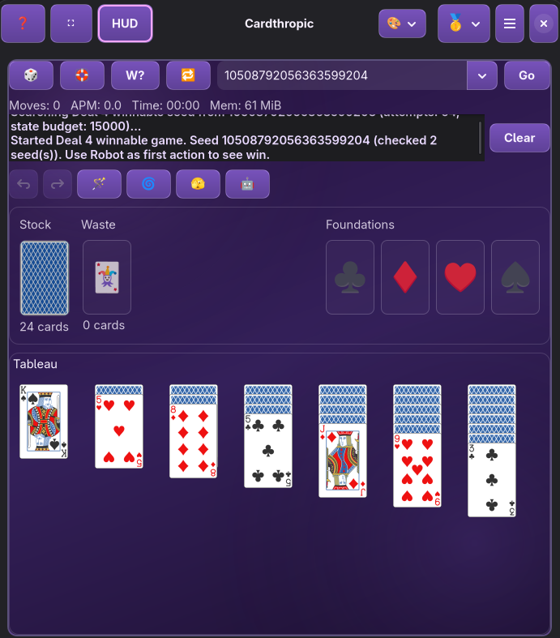

# Cardthropic

Cardthropic is a modern GNOME solitaire app built with Rust, GTK4, and Libadwaita.


Current version: `0.8.0` (alpha channel)
License: `GPL-3.0-or-later`
App ID: `io.codeberg.emviolet.cardthropic`



## What It Includes

- Native GNOME UX with keyboard, mouse, and drag-and-drop interaction
- Seed-first workflow with history and replay controls (`🎲`, `🛟`, `W?`, `🔁`, `Go`)
- Automation tools:
  - `🪄` Magic Wand
  - `⚡` Rapid Wand
  - `🤖` Robot Mode
  - `🌀` Cyclone Shuffle
  - `🫣` Peek
- Smart Move modes: `Double Click`, `Single Click`, `Disabled`
- Session persistence and resume
- APM private metrics and in-app APM graph
- Built-in themes + custom CSS userstyle editor

## Variant Status

| Variant | Status | Notes |
|---|---|---|
| Klondike | Playable | Full gameplay flow with draw-mode settings, automation, and seed tooling |
| Spider | Playable | Multi-suit modes (`1/2/3/4`), automation, Smart Move, and `W?` support |
| FreeCell | Not yet available | Menu entry is visible but disabled until engine-ready |

## Controls and Shortcuts

- `F1` Help
- `F11` Fullscreen
- `Space` Draw/Deal from stock
- `Ctrl+Z` Undo
- `Ctrl+Y` Redo
- `Ctrl+Space` Magic Wand
- `Ctrl+Shift+Space` Rapid Wand
- `F3` Peek
- `F5` Cyclone Shuffle
- `F6` Robot Mode
- `Ctrl+R` Random seed
- `Ctrl+Shift+R` Random winnable-seed search
- `Ctrl+Q` Quit

Custom CSS editor:

- `Ctrl+C` Copy CSS
- `Ctrl+V` Paste CSS
- `Ctrl+Shift+C` Copy preset + CSS

## Install

Cardthropic is currently distributed as Flatpak.

### Option A: Install from Codeberg Pages Remote (alpha)

```bash
flatpak remote-add --if-not-exists --user --no-gpg-verify cardthropic https://emviolet.codeberg.page/Cardthropic-flatpak/
flatpak update --user --appstream cardthropic
flatpak install --user cardthropic io.codeberg.emviolet.cardthropic
flatpak run io.codeberg.emviolet.cardthropic
```

### Option B: Install from Bundle (`cardthropic.flatpak`)

```bash
flatpak remote-add --if-not-exists flathub https://flathub.org/repo/flathub.flatpakrepo
flatpak install ./cardthropic.flatpak
flatpak run io.codeberg.emviolet.cardthropic
```

## Build and Run (Developer)

### Native (cargo)

```bash
cargo check
cargo run
```

Optional:

```bash
cargo test -q
```

### Flatpak local workflow

```bash
scripts/flatpak/bootstrap.sh
scripts/flatpak/build-install.sh
scripts/flatpak/run.sh
```

## Maintainer Tooling

This repository is an alpha testbed. Scripts under `scripts/` are maintainer-oriented operational tooling for this project.

Quality gate:

```bash
scripts/release/maintainer-gate.sh
```

Strict shell tooling pass:

```bash
scripts/release/lint-shell.sh --strict-tools
```

Version bump helper:

```bash
scripts/release/bump-version.sh --version X.Y.Z
```

Release-note finalizer:

```bash
scripts/release/finalize-release-notes.sh --version X.Y.Z --note "First note" --note "Second note"
```

Automated release pipeline:

```bash
scripts/flatpak/release.sh
```

For full release procedure, see `RELEASE.md`.

## Notes

- Runtime target: `org.gnome.Platform//48`
- Current Codeberg alpha remote is intentionally unsigned (`--no-gpg-verify`)
- Flatpak is the official distribution channel for this project right now

## Project Docs

- `CHANGELOG.md`
- `RELEASE.md`
- `data/io.codeberg.emviolet.cardthropic.metainfo.xml.in`
