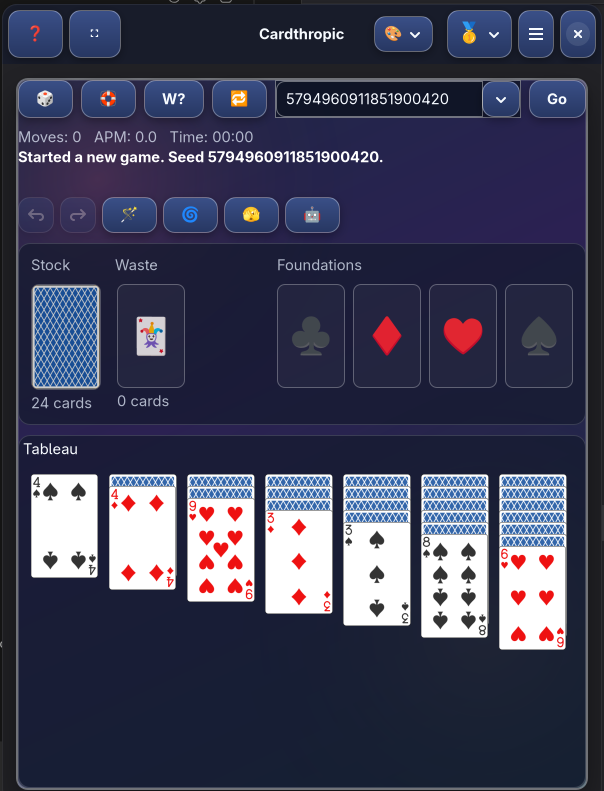

# Cardthropic

Cardthropic is a modern GNOME solitaire app built with Rust, GTK4, and Libadwaita.
It currently ships a full Klondike experience, with architecture prepared for more variants.


Current version: `0.5.1`
License: `GPL-3.0-or-later`



## Highlights

- Native GNOME UI with keyboard, mouse, and drag-and-drop play.
- Seed-first gameplay (`🎲`, `🛟`, `W?`, `🔁`, `Go`) with persistent seed history.
- Advanced automation:
  - `🪄` Wave Magic Wand
  - `⚡` Rapid Wand
  - `🤖` Robot Mode
  - `🌀` Cyclone Shuffle
  - `🫣` Peek
- Smart Move modes: `Double Click`, `Single Click`, `Disabled`.
- Draw modes: Deal `1/2/3/4/5`.
- Session resume after restart/crash.
- Actions-per-minute telemetry + in-app APM graph.
- Full theming system:
  - curated built-in presets
  - custom CSS userstyle editor
  - clipboard-only CSS workflows (no filesystem access)

## Built-in Theme Presets

From the `🎨` menu:

- Cardthropic
- Cardthropic Night
- Cardthropic Midnight
- Arcade
- Glass
- Neon
- Noir
- Forest
- CRT
- Terminal
- Minimal Mono
- Custom (opens CSS editor)

## Shortcuts

- `F1` Help
- `F11` Toggle Fullscreen
- `Space` Draw
- `Ctrl+Z` Undo
- `Ctrl+Y` Redo
- `Ctrl+Space` Wave Magic Wand
- `Ctrl+Shift+Space` Rapid Wand
- `F3` Peek
- `F5` Cyclone Shuffle Tableau
- `F6` Robot Mode
- `Ctrl+R` Start Random Deal
- `Ctrl+Shift+R` Start Winnable Deal Search
- `Ctrl+Q` Quit

Custom CSS editor:

- `Ctrl+C` Copy CSS
- `Ctrl+V` Paste CSS
- `Ctrl+Shift+C` Copy Preset + CSS

## Install (Recommended)

Cardthropic is best installed from the official Flatpak repo so GNOME Software can show full metadata (license, releases, screenshots, updates).

### Option A: Flatpak remote

```bash
flatpak remote-add --if-not-exists --user --no-gpg-verify cardthropic https://emviolet.codeberg.page/cardthropic-flatpak/
flatpak update --user --appstream cardthropic
flatpak install --user cardthropic io.codeberg.emviolet.cardthropic
flatpak run io.codeberg.emviolet.cardthropic
```

### Option B: Direct bundle

If you only have `cardthropic.flatpak`:

```bash
flatpak remote-add --if-not-exists flathub https://flathub.org/repo/flathub.flatpakrepo
flatpak install ./cardthropic.flatpak
flatpak run io.codeberg.emviolet.cardthropic
```

### Ubuntu (GNOME Software + Flatpak)

1. Follow the official Flathub setup guide:
   <https://flathub.org/setup/Ubuntu>
2. Install integration packages:

```bash
sudo apt install flatpak gnome-software-plugin-flatpak
```

3. Log out/in (or reboot).
4. Ensure runtime dependency is available:

```bash
flatpak remote-add --if-not-exists flathub https://flathub.org/repo/flathub.flatpakrepo
flatpak install -y flathub org.gnome.Platform//48
```

5. Add Cardthropic remote and install:

```bash
flatpak remote-add --if-not-exists --user --no-gpg-verify cardthropic https://emviolet.codeberg.page/cardthropic-flatpak/
flatpak update --user --appstream cardthropic
flatpak install --user cardthropic io.codeberg.emviolet.cardthropic
```

Packaging policy: Official builds are Flatpak-only. Native packages (`.deb`, `.rpm`, `snap`) are welcome as community-maintained ports.

## For Developers

### Rust local run

```bash
cargo check
cargo run
```

### Flatpak local dev workflow

```bash
scripts/flatpak/bootstrap.sh
scripts/flatpak/build-install.sh
scripts/flatpak/run.sh
```

### Publish/update Flatpak repo (Codeberg Pages)

```bash
scripts/flatpak-repo/master.sh
```

## Packaging/Safety Notes

- App ID: `io.codeberg.emviolet.cardthropic`
- Flatpak runtime: `org.gnome.Platform//48`
- Flathub is required as runtime source for end-user bundle installs.
- AppStream metadata is GPLv3+ and screenshot-enabled.
- Runtime permissions avoid network access.

## Status

- Klondike is highly playable and polished.
- Engine/window modularization is in active progress for scalable multi-variant growth.
- Spider and FreeCell scaffolding already exists in the mode system.

## Release Notes

### 0.5.1 (2026-02-13)

- Performance and stability hotfix release.
- Fixed solver/automation memory growth by making parallel winnability work cancelable and joining worker threads cleanly.
- Added bounded caches for autoplay/loss-analysis state to prevent unbounded retention in long sessions.
- Reduced background disk writes with debounced session persistence (dirty + delayed flush) while preserving resume safety.
- Fixed post-robot background CPU churn by replacing per-frame geometry polling with interval polling and canceling stale loss-analysis work.
- Added card texture caching to reduce repeated texture allocation churn during rapid render/automation loops.

### 0.5.0 (2026-02-13)

- Major post-0.3.1 release with substantial gameplay, architecture, and UX upgrades.
- Smart Move correctness improvements and stronger solver-aligned move logic.
- Deep engine/window modularization for long-term maintainability and variant expansion.
- Theming overhaul: curated preset system, identity themes, and stronger visual direction.
- New `🎨` theme popover UX with full preset list.
- Custom CSS editor upgrades:
  - dark code editor scheme
  - clipboard actions + shortcuts
  - editor font-size control
  - resizable/snap/maximize-capable dialog window
- Metadata refresh with new screenshot and release details.

### 0.3.1 (2026-02-12)

- Hotfix release focused on appearance interaction polish.

### 0.3.0 (2026-02-12)

- Gameplay polish update with smarter automation, expanded controls, persistent sessions, and refreshed Flatpak metadata/screenshots.

### 0.2.1 (2026-02-11)

- Polish update: fixed tableau pixel-shift jitter, added Rapid Wand automation, and corrected dock/taskbar icon resolution for Builder and Flatpak installs.

### 0.2.0 (2026-02-11)

- Initial public preview with Klondike gameplay and adaptive layout.
