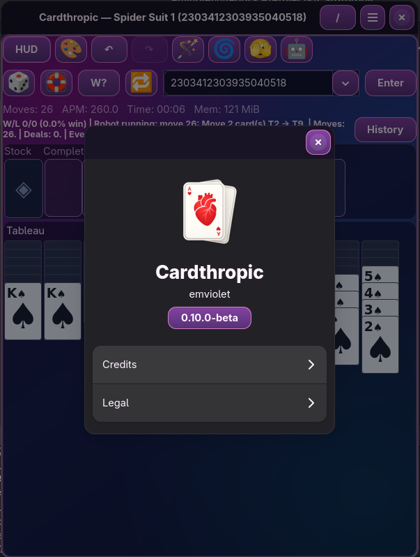

# Cardthropic

Cardthropic is a Linux game suite built with Rust, GTK4, and Libadwaita.

Current version: `0.10.0-beta` (beta channel)
License: `GPL-3.0-or-later`
App ID: `io.codeberg.emviolet.cardthropic`



## What Cardthropic Includes

### Game Modes

- Klondike with deal modes: 1, 2, 3, 4, or 5
- Spider with suit modes: 1, 2, 3, or 4
- FreeCell with card-count modes: 26, 39, or 52
- Configurable FreeCell free-cell count (`1..6`)
- Chess modes in preview:
  - Standard Chess
  - Chess960
  - Atomic Chess

### Core Play Tools

- Smart Move with click behavior control (single, double, right click, disabled)
- Undo/redo and mode-aware move handling
- Mouse, keyboard, and drag-and-drop interaction
- Command palette and visible shortcut hints on key controls

### Automation and Analysis

- Wave Magic Wand and Rapid Wand actions
- Robot mode, Forever mode, and optional auto-new-game on loss
- `W?` analysis with cancel-on-repeat behavior
- Cyclone Shuffle and Peek utilities
- Chess auto-response controls (including side selection)
- Independent chess AI strength channels:
  - auto-response
  - Wand
  - `W?`
  - robot white
  - robot black

### Seeds, Reproducibility, and Game State

- Deterministic seed workflow for replayable games
- Numeric (`u64`) and word seeds (letters + underscores)
- Random seed and random winnable-seed actions
- Seed history with back/forward navigation
- Copy/load game-state actions
- Session restore across relaunch, including chess state

### UI, Status, and Notes

- Status history window with non-modal workflow
- Insert note support in status history and game-state menu
- `Copy All` for status history content
- Chess board coordinate overlays (`A-H`, `1-8`) with toggle
- Flip-board-aware chess keyboard navigation
- Optional chess system move sounds (rate-limited)

### Visuals and Customization

- CSS + Unicode card rendering pipeline (replacing SVG/PNG card-sheet runtime rendering)
- Built-in theme presets
- Custom CSS userstyle editor and saved userstyle support
- Responsive layout behavior for compact and desktop windows

### Settings and Runtime

- Runtime HUD metrics (APM/memory/status)
- Copy all Cardthropic GSettings values to clipboard
- Strict validation path to load full Cardthropic GSettings payload
- Flatpak-first distribution and GNOME runtime integration

## Mode Status

| Variant | Status | Notes |
|---|---|---|
| Klondike | Playable | Deal modes, automation, seeds, and Smart Move controls |
| Spider | Playable | 1/2/3/4 suit modes, automation, Smart Move, and `W?` support |
| FreeCell | Playable | Card-count modes, configurable free-cell count, automation, and `W?` support |
| Standard Chess | Preview | Board controls, auto-response, `W?` analysis, and robot support |
| Chess960 | Preview | Variant setup and shared chess tooling |
| Atomic Chess | Preview | Atomic ruleset integration with shared chess tooling |

## Installation

Cardthropic is currently distributed as Flatpak.

### Local Bundle (`cardthropic.flatpak`)

```bash
flatpak remote-add --if-not-exists flathub https://flathub.org/repo/flathub.flatpakrepo
flatpak install ./cardthropic.flatpak
flatpak run io.codeberg.emviolet.cardthropic
```

## Build and Run

### Native

```bash
cargo check
cargo run
```

Optional tests:

```bash
cargo test -q
```

### Flatpak Dev Loop

```bash
scripts/flatpak/bootstrap.sh
scripts/flatpak/build-install.sh
scripts/flatpak/run.sh
```

## Seed Workflow

Cardthropic is designed around deterministic, replayable seeds.

- Enter a numeric seed (`u64`) or a word seed in the seed box
- Word seeds accept letters and underscores
- Use random seed and random winnable-seed actions for fast exploration
- Use seed history to jump backward/forward through prior runs

## Robot Behavior

Robot mode is practical but intentionally non-perfect.

- It can recover from many bad lines
- It can still lose games a skilled human could win
- Loss handling and auto-start behavior are configurable in Automation settings

## Keyboard Notes

- Seed box input is preserved; Enter is intentionally not globally bound
- Core gameplay shortcuts remain available through the app shortcut layer
- Chess board coordinate visibility toggle: `<Ctrl><Alt>C`

## Maintainer and Release Workflow

This repository is a beta testbed. Scripts under `scripts/` are maintainer-focused tooling.

Core release flow:

```bash
scripts/release/check-release-consistency.sh
scripts/release/maintainer-gate.sh
scripts/flatpak/release.sh
scripts/release/post-release-check.sh --version X.Y.Z[-PRERELEASE]
```

Manual version bump helper:

```bash
scripts/release/bump-version.sh --version X.Y.Z[-PRERELEASE]
```

Full process details: `RELEASE.md`

## Project Docs

- `CHANGELOG.md`
- `RELEASE.md`
- `docs/TOOLING_WORKFLOW.md`
- `data/io.codeberg.emviolet.cardthropic.metainfo.xml.in`

## Notes

- Runtime target: `org.gnome.Platform//48`
- Flatpak is the official distribution channel for now
