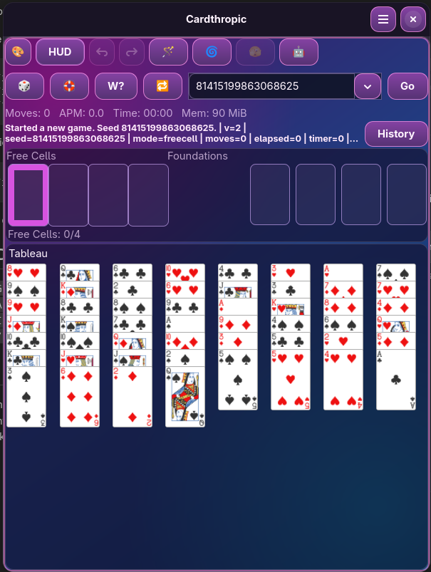

# Cardthropic

Cardthropic: Solitaire with a Real Heart.
Cardthropic is a GNOME solitaire app built with Rust, GTK4, and Libadwaita.

Current version: `0.9.0-beta.1` (beta channel)
License: `GPL-3.0-or-later`
App ID: `io.codeberg.emviolet.cardthropic`



## What Cardthropic Includes

### Gameplay

- Klondike, Spider, and FreeCell in one app
- Spider suit modes: 1, 2, 3, or 4 suits
- Smart Move with click-mode control (single, double, disabled)
- Undo/redo, move counting, timers, and run progress tracking

### Automation

- Magic Wand and Rapid Wand hint actions
- Robot mode for continuous auto-play
- Cyclone Shuffle and Peek utilities
- Automation settings, including auto-start-new-game on loss toggle

### Seeds and Reproducibility

- Deterministic seed-first workflow for replayable deals
- Numeric (`u64`) and word seeds (letters + underscores)
- Random seed and random winnable-seed actions
- Seed history with fast back/forward navigation
- `W?` winnability analysis and mode-specific solver routing

### UX and Controls

- Native GTK4/Libadwaita desktop experience
- Mouse, keyboard, and drag-and-drop interaction
- Focus-safe seed input behavior for uninterrupted seed entry
- In-app history/status reporting for solver and robot activity

### Visuals and Customization

- Built-in themes for quick style switching
- Custom CSS userstyle support
- Responsive layout behavior across compact and desktop windows

### Persistence and Runtime

- Session persistence and resume on relaunch
- Runtime metrics in HUD (APM/memory/status)
- Flatpak-first distribution and GNOME runtime integration

## Variant Status

| Variant | Status | Notes |
|---|---|---|
| Klondike | Playable | Core gameplay, draw modes, automation, and seed tooling |
| Spider | Playable | 1/2/3/4 suit modes, automation, Smart Move, and winnability tooling |
| FreeCell | Playable | Full gameplay loop with Free Cells, Foundations, Smart Move, and automation tooling |

## Installation

Cardthropic is currently distributed as Flatpak.

### Local Bundle (`cardthropic.flatpak`)

```bash
flatpak remote-add --if-not-exists flathub https://flathub.org/repo/flathub.flatpakrepo
flatpak install ./cardthropic.flatpak
flatpak run io.codeberg.emviolet.cardthropic
```

## Build and Run

### Native

```bash
cargo check
cargo run
```

Optional tests:

```bash
cargo test -q
```

### Flatpak Dev Loop

```bash
scripts/flatpak/bootstrap.sh
scripts/flatpak/build-install.sh
scripts/flatpak/run.sh
```

## Seed Workflow

Cardthropic is designed around deterministic, replayable seeds.

- Enter a numeric seed (`u64`) or a word seed in the seed box
- Word seeds accept letters and underscores
- Use random seed and random winnable-seed actions for fast exploration
- Use seed history to jump backward/forward through prior runs

## Robot Behavior

Robot mode is practical but intentionally non-perfect.

- It can recover from many bad lines
- It can still lose games a skilled human could win
- Loss handling and auto-start behavior are configurable in Automation settings

## Keyboard Notes

- Seed box input is preserved; Enter is intentionally not globally bound
- Core gameplay shortcuts remain available through the app shortcut layer

## Maintainer and Release Workflow

This repository is a beta testbed. Scripts under `scripts/` are maintainer-focused tooling.

Core release flow:

```bash
scripts/release/check-release-consistency.sh
scripts/release/maintainer-gate.sh
scripts/flatpak/release.sh
```

Manual version bump helper:

```bash
scripts/release/bump-version.sh --version X.Y.Z
```

Full process details: `RELEASE.md`

## Project Docs

- `CHANGELOG.md`
- `RELEASE.md`
- `TOOLING_WORKFLOW.md`
- `data/io.codeberg.emviolet.cardthropic.metainfo.xml.in`

## Notes

- Runtime target: `org.gnome.Platform//48`
- Flatpak is the official distribution channel for now
